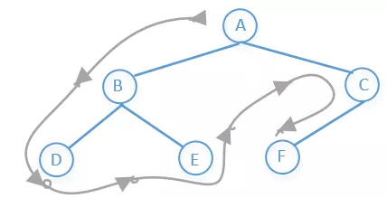
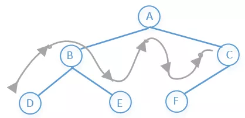

#####  二插树的遍历

***

二叉树的节点类

```cpp
struct TreeNode {
    int val;
    TreeNode *left;
    TreeNode *right;
    TreeNode() : val(0), left(nullptr), right(nullptr) {}
    TreeNode(int x) : val(x), left(nullptr), right(nullptr) {}
    TreeNode(int x, TreeNode *left, TreeNode *right) 
        : val(x), left(left), right(right) 
     {}
};
```


***

**前序遍历**

> 访问顺序：根节点 -> 左子树 -> 右子树
>
> 根据上图前序遍历结果：A -> B -> D -> E -> C ->F
>
> 如下图：



**代码实现**

递归

```cpp
void PreOrderTraversal(TreeNode* root) 
{
	if(root == NULL) return;
    cout << root->val << " " << endl;   // 根节点处理
    PreOrderTraversal(root->left);      // 左子树处理
    PreOrderTraversal(root->right);     // 右子树处理
}
```

非递归

```cpp
void PreOrderTraversal(TreeNode* root)
{
    if(root == NULL) return;
    stack<TreeNode*> stk;
    stk.push(root);
    while(stk.size()) {
        TreeNode* node = stk.top(); stk.pop();
        cout << node->val << " " << endl;  // 根节点处理
        if(node->right != NULL) {          // 先添加右节点，保证右子树后处理
            stk.push(node->right);
        }
        if(node->left != NULL) {           // 后添加左节点，保证左子树先处理
            stk.push(node->left);
        }
    }
}
```

***

**中序遍历**

> 访问顺序 : 左子树 ->  根节点 -> 右子树
>
> 示例访问结果：  D -> B -> E -> A -> F -> C
>
> 如下图：



**代码实现**

递归

```cpp
void InOrderTraversal(TreeNode* root) 
{
    if(root == NULL) root;
    InOrderTraversal(root->left);     // 访问左子树
    cout << root->val << " " << endl; // 访问根节点
    InOrderTraversal(root->right);    // 访问右子树
}
```

非递归

```
void InOrderTraversal(TreeNode* root) 
{
	stack<TreeNode*> stk;
	while(root || stk.size()) {
		while(root) {
			stk.push(root);
			root = root->left;
		}
		root = stk.top(); stk.pop();
		cout << root->val << " " << endl;
		root = root->right;
	}
}
```

***

**后序遍历**

> 左子树 -> 右子树 -> 根节点
>
> 示例访问结果：D -> E -> B -> F -> C -> A
>
> 如下图所示：

递归

```cpp
void PosOrderTraversal(TreeNode *root) 
{
	if(root == NULL) return;
    PosOrderTraversal(root->left);
    PosOrderTraversal(root->right);
    cout << root->val << " " << endl;
}
```

非递归

```cpp
void PosOrderTraversal(TreeNode *root) 
{
    if(root==NULL) return; 
    stack<TreeNode*> stk;
    stk.push(root);
    TreeNode* pre = NULL;
    TreeNode* node = root; 
    while(stk.size()||node) {
        // 1.遍历到最左子节点
        while(node) {
            stk.push(node);
            node = node->left;
        }
        node = stk.top(); stk.pop();
        // 2.遍历最左子节点的右子树(右子树存在 && 未访问过)
        if(node->right&&node->right!=pre) {
            // 重复压栈以记录当前路径分叉节点
            stk.push(node);
            node = node->right;
        } else {
            // 后序：填充vec在node->left和node->right后面
            // 注意：此时node的左右子树应均已完成访问
            cout << node->val << " " << endl;
            pre = node;      // 避免重复访问右子树
            node =nullptr;   // 避免重复访问左子树
        }
    }
    
}
```

